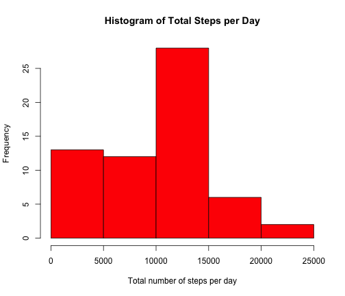

# Reproducible Research: Peer Assessment 1


## Loading and preprocessing the data
### Load the data file 

```r
library('plyr')
library('lattice')
md<-read.csv('activity.csv');
```


## Summarization of total number of steps per day
First, we plot histogram of total number of steps each day. 

```r
ss<-ddply(md,~date,summarise,totalSteps=sum(steps,na.rm=TRUE))
hist(ss$totalSteps, xlab='Total number of steps per day',main='Histogram of Total Steps per Day', col='red')
```

 
Next, we compute the mean and median of the total steps each day

```r
meantn<-mean(ss$totalSteps)
mediantn<-median(ss$totalSteps)
```
As we can see, the mean is 9354.2295, and the median is 10395.

## Explore the average daily activity pattern
First, we compute the average number of steps taken, averaged across all days, at each time interval. Then, the result is shown in a time series plot.

```r
ss2<-ddply(md,~interval,summarise,aveSteps=mean(steps,na.rm=TRUE))
plot(ss2$interval, ss2$aveSteps, "l", xlab="Time Interval", ylab="Average Steps Accross All Days")
```

 

```r
maxAveStep<-which.max(ss2$aveSteps)
```
We know that the maximum number of steps happens at time intervel 'r maxAveStep'.

## Imputing missing values
First, we need to know how many observations are missing. 

```r
numMissing<-sum(is.na(md$steps))
```
We know that there are 2304 missing values in the dataset in total. In order to fill in the missing values, we replace them with the mean of the number of steps taken at that time interval accross all days. 

```r
nd<-md ## create a variable
idx<-which(is.na(md$steps)) ## find missing values
for (i in idx){
  nd[i,1]<-ss2[which(ss2$interval==md[i,3]),2] ## filling in
}
```
Now, let's see the histogram of total number of steps each day, agian.

```r
ss3<-ddply(nd,~date,summarise,totalSteps=sum(steps))
hist(ss3$totalSteps, xlab='Total number of steps per day',main='Histogram of Total Steps per Day of the new data', col='red')
```

 
Also, let's see how the mean and median of the total steps each day will change to.

```r
meantnn<-mean(ss3$totalSteps)
mediantnn<-median(ss3$totalSteps)
```
Now, the mean turns to be 1.0766 &times; 10<sup>4</sup>, and the median is 1.0766 &times; 10<sup>4</sup>. So, we can see that, by filling in the missing value, the total number of steps in each day increases a lot. And the left part of the old histogram shifts towards the centers, due to the increase of total number of steps. 

## Are there differences in activity patterns between weekdays and weekends?
First, we should determine the observation is obtained on weekday of weekend. 

```r
wd<-weekdays(as.Date(nd$date),TRUE)
wd<-sapply(wd,function(x) if(x=="Sat"||x=="Sun"){return(2)}else{return(1)})
nd$weekday<-factor(wd, levels=c(1,2),labels=c('weekday','weekend'))
ss4<-ddply(nd,.(interval,weekday),summarise,aveSteps=mean(steps))
xyplot(ss4$aveSteps~ss4$interval|ss4$weekday, type="l", layout=c(1,2), xlab="Intervals", ylab="Number of Steps")
```

 
Obviousely, we can see that people take less steps at daytime during weekday than that in weekend, maybe due to the heavy work load.

